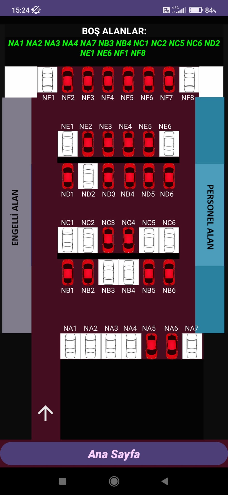
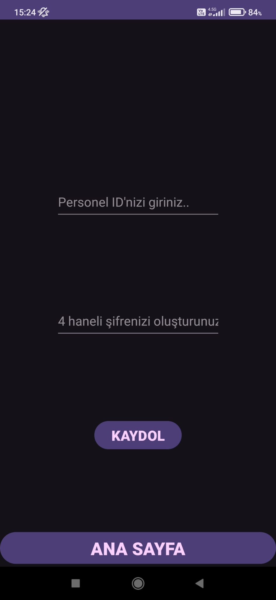
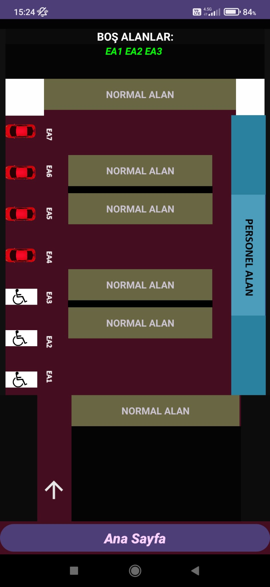
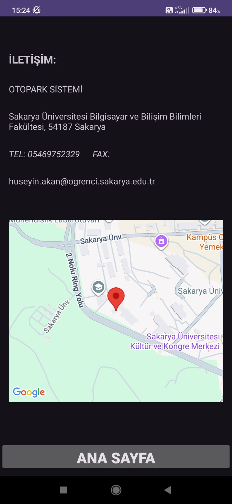

# Akıllı Otopark Yönlendirme ve Yönetim Sistemi 🚗

Bu proje, **Android platformu** üzerinde **Java** diliyle geliştirilmiş, otopark yönetimini dijitalleştiren ve kullanıcıları uygun park alanlarına yönlendiren bir **mobil uygulamadır**.

Uygulama; park alanlarının kategorize edilmesi, rol bazlı kullanıcı yönetimi ve harita destekli yönlendirme özellikleriyle akıllı otopark sistemlerinin temel işlevlerini mobil ortamda sunmayı amaçlamaktadır.

---

## 📱 Uygulama İçi Görüntüler

<p align="center">
  
  
  
  
  
  
</p>

---

## 🌟 Öne Çıkan Özellikler

* **Dinamik Park Alanı Kategorizasyonu:** Otopark alanları; **Personel, Engelli ve Normal** olmak üzere üç farklı kategoride yönetilir.
* **Rol Bazlı Kimlik Doğrulama:** Personeller için özel kayıt ve giriş ekranları mevcuttur.
* **SQLite ile Yerel Veri Yönetimi:** Kullanıcı verileri ve otopark durum bilgileri cihaz üzerinde SQLite veritabanında güvenli bir şekilde saklanır.
* **Harita Entegrasyonu:** Google Maps SDK kullanılarak otopark lokasyon bilgileri görselleştirilmiştir.
* **İletişim Modülü:** Kullanıcıların yönetimle iletişime geçebileceği entegre form alanı.

## 🛠 Kullanılan Teknolojiler ve Araçlar

* **Dil:** Java
* **Platform:** Android (Min SDK: 21)
* **IDE:** Android Studio
* **Veritabanı:** SQLite (Local Persistence)
* **API:** Google Maps SDK

## 🚀 Kurulum

1.  Projeyi bilgisayarınıza klonlayın:
    ```bash
    git clone [https://github.com/huseyinakan/otopark-yonlendirme-sistemi.git](https://github.com/huseyinakan/otopark-yonlendirme-sistemi.git)
    ```
2.  Android Studio'yu açın ve projeyi "Open" diyerek seçin.
3.  `local.properties` dosyasını oluşturun ve Google Maps API anahtarınızı ekleyin:
    ```
    MAPS_API_KEY=YOUR_API_KEY
    ```
4.  Projeyi bir emülatör veya gerçek bir Android cihazda çalıştırın.

## 🎓 Proje Amacı
Bu çalışma, bilgisayar mühendisliği eğitimi kapsamında geliştirilmiş olup; mobil programlama, veritabanı yönetimi ve kullanıcı deneyimi (UX) tasarımı konularındaki yetkinlikleri pekiştirmeyi amaçlamaktadır.
